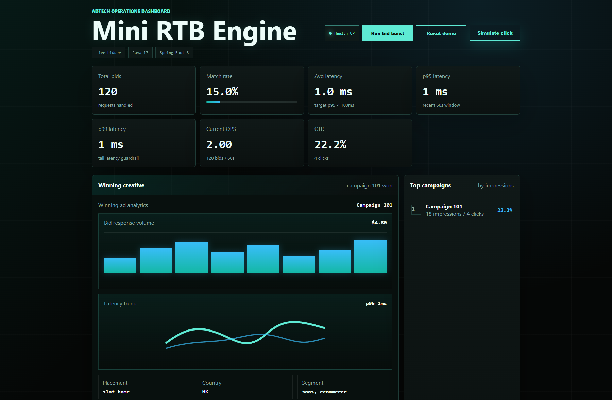
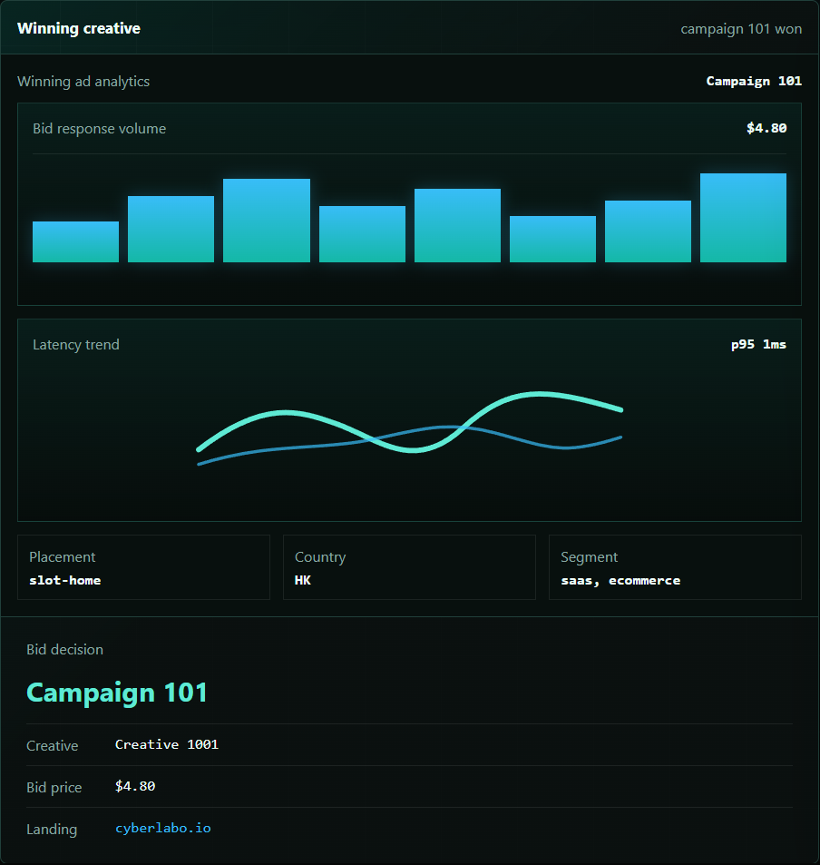
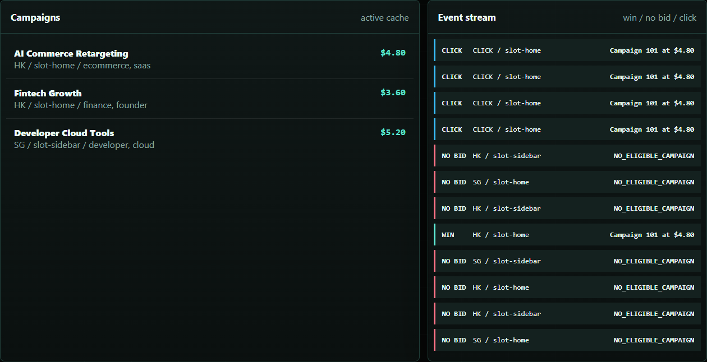
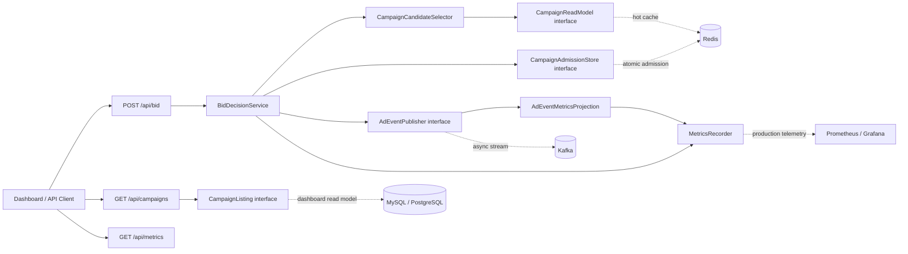

# Mini RTB Engine

Interview-ready Java 17 / Spring Boot 3 demo for a miniature real-time bidding system.

This project shows the core backend path of an AdTech bidding service: receive a bid request, find eligible campaigns, enforce budget and frequency caps, choose a winning ad, publish impression/click events, and expose live operational metrics on a dashboard.

It is intentionally small, but the design follows production-friendly boundaries so it is easy to discuss how the in-memory demo can evolve into Redis, Kafka, database-backed campaign management, and production observability.

## Live Demo

Public demo:

[https://mini-rtb-engine.onrender.com](https://mini-rtb-engine.onrender.com)

The demo is hosted on Render's free web service plan. If it has been idle, the first request may take around 50 seconds while the service wakes up.

Try this flow:

1. Open the live dashboard.
2. Click `Run bid burst`.
3. Watch match rate, latency, QPS, winning creative, top campaign, and event stream update.
4. Click `Simulate click` to update CTR from the click event path.

## Dashboard Preview



The dashboard is built to make the backend behavior visible during a short demo: bid volume, match rate, latency, QPS, CTR, the winning creative, campaign ranking, and the live event stream all update from the same local service.





## Project Highlights

- Low-latency `POST /api/bid` path with no database call in the hot request flow.
- Campaign eligibility by placement, country, user segment, status, budget, and frequency cap.
- Unified campaign admission interface for budget and frequency cap checks.
- Ranked campaign candidate selection before admission.
- Impression and click events projected into metrics, so CTR and top campaigns come from ad events.
- Operational metrics for total bids, match rate, average latency, p95/p99 latency, QPS, impressions, clicks, CTR, and top campaigns.
- Demo-only reset endpoint guarded by configuration, so local demos stay convenient without mixing demo controls into production mode.
- Static dashboard served by Spring Boot locally and on the public Render demo.

Default local mode uses H2 for bootstrapping and in-memory stores for the bidding demo, so the project can run without Docker, MySQL, Redis, or Kafka.

## Architecture



## Production Extension Points

| Concern | Current demo | Production replacement |
| --- | --- | --- |
| Campaign read path | `CampaignReadModel` via `InMemoryCampaignCatalog` | MySQL/PostgreSQL as source of truth, Redis/local cache for hot request-shaped reads |
| Campaign listing | `CampaignListing` via `InMemoryCampaignCatalog` | Database-backed admin/reporting read model for dashboard display |
| Campaign admission | `InMemoryCampaignAdmissionStore` | Redis Lua script or strongly consistent admission service |
| Event pipeline | `InMemoryAdEventPublisher` + `AdEventMetricsProjection` | Kafka topic for impressions/clicks, async reporting consumers |
| Metrics | `MetricsRecorder` in memory | Micrometer, Prometheus, Grafana, or OpenTelemetry |
| Demo reset | `DemoStateResetter` enabled in local config | Disabled in production profile |

`docker-compose.yml` includes MySQL, Redis, Kafka, and the app as a deployment scaffold. The current business logic does not yet persist campaigns to MySQL or publish events to Kafka by default; those are the next production adapters to implement.

## Why It Fits an AdTech Backend Role

- RTB systems care about request-path latency, so the bid endpoint avoids slow dependencies.
- Budget and frequency cap are handled together as one admission decision, which is closer to real campaign serving correctness.
- Metrics are projected from impression and click events instead of being manually patched into the dashboard.
- The code separates hot campaign reads from dashboard listing, which leaves room for different storage and caching strategies.
- p95 and p99 latency are shown because tail latency matters more than average latency in bidding systems.
- The dashboard makes the architecture easy to explain to non-technical reviewers first, then lets technical interviewers drill into the code.

## Run Locally

This project targets Java 17 and Spring Boot 3.

On this Windows machine, the helper script uses the JDK installed on D drive and keeps Maven dependencies inside the project:

```powershell
cd <project-root>\mini-rtb-engine
.\scripts\run-local.cmd
```

Then open:

```text
http://localhost:8080
```

Run tests:

```powershell
$env:JAVA_HOME='D:\Java\jdk-17.0.19+10'
$env:Path="$env:JAVA_HOME\bin;$env:Path"
$env:MAVEN_OPTS="-Dmaven.repo.local=$PWD\.m2\repository"
& '..\.tools\apache-maven-3.9.9\bin\mvn.cmd' test
```

Default local runs do not require MySQL. To try the MySQL profile after starting MySQL:

```bash
mvn spring-boot:run -Dspring-boot.run.profiles=mysql
```

Full infrastructure scaffold:

```bash
docker compose up --build
```

## Deploy on Render

This repository includes a `render.yaml` Blueprint and Docker-based deployment setup.

Suggested Render setup:

1. Open Render and choose `New` -> `Blueprint`.
2. Connect this GitHub repository.
3. Select the `main` branch.
4. Keep the detected `mini-rtb-engine` web service on the free plan.
5. Deploy.

Render provides the public `onrender.com` URL after the first successful deploy.

The app reads Render's `PORT` environment variable through:

```yaml
server:
  port: ${PORT:8080}
```

This keeps local development on `8080` while allowing Render to route public traffic correctly.

## API Examples

Bid request:

```bash
curl -X POST http://localhost:8080/api/bid \
  -H "Content-Type: application/json" \
  -d '{
    "requestId": "req-1001",
    "userId": "user-42",
    "placementId": "slot-home",
    "device": "mobile",
    "country": "HK",
    "userSegments": ["saas", "ecommerce"]
  }'
```

Click event:

```bash
curl -X POST http://localhost:8080/api/events/click \
  -H "Content-Type: application/json" \
  -d '{
    "requestId": "req-1001-click",
    "impressionRequestId": "req-1001",
    "userId": "user-42",
    "campaignId": 101
  }'
```

Metrics:

```bash
curl http://localhost:8080/api/metrics
```

## Demo Script

1. Open the dashboard.
2. Click `Run bid burst`.
3. Explain the path: campaign match, admission check, winner selection, impression event, and metrics projection.
4. Show `Match rate`, `p95 latency`, `p99 latency`, `60s avg QPS`, CTR, and top campaigns changing.
5. Click `Simulate click` and show CTR updating from the event stream.
6. Explain the production path: MySQL for campaign source of truth, Redis for hot atomic admission, Kafka for event streaming, and Prometheus/Grafana for observability.

## Load Test

Run after the app starts:

```bash
k6 run loadtest/bid.js
```

The included k6 script targets:

- error rate `< 1%`
- p95 latency `< 100ms`

Use the dashboard and `/api/metrics` output as the source of truth for current local numbers.

## Test Coverage

Current tests cover:

- winner selection by highest eligible bid
- insufficient budget filtering
- campaign candidate fallback behavior
- budget and frequency cap admission
- demo state reset behavior
- demo reset controller configuration
- click request validation
- bounded event publisher behavior
- event type projection for impressions and clicks
- average latency, p95/p99 latency, match rate, 60s average QPS, event-projected CTR, and top campaign metrics

Run:

```bash
mvn test
```

At the time of this update, the suite has 20 tests.

## Next Improvements

- Add a Redis adapter for campaign admission.
- Add Kafka producer/consumer adapters for impression and click events.
- Persist campaign configuration in MySQL with a cached read model.
- Add a repeatable load-test report table after running k6 locally.
- Add Micrometer timers so p95/p99 can come from production-grade instrumentation.
